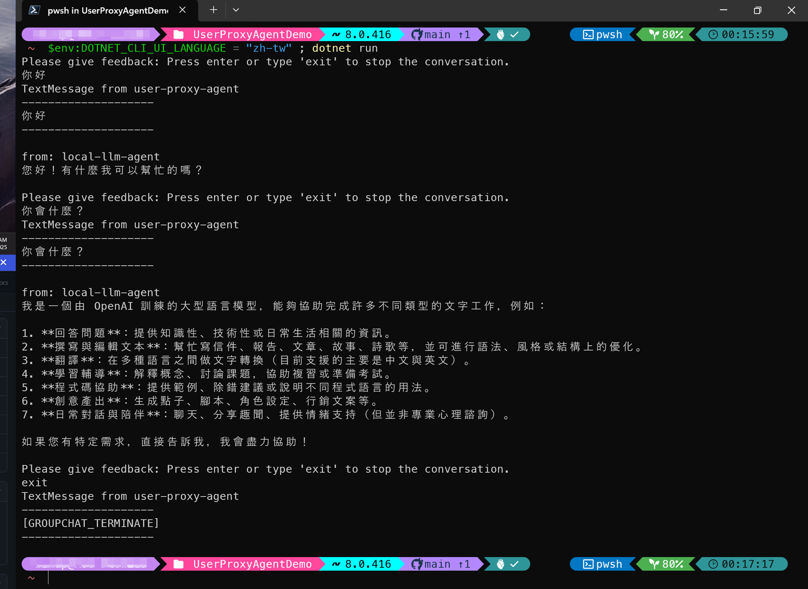

# AutoGen for .NET (v0.2.x) using Local LLM (OpenAI's gpt-oss-20b model) as agent AI model

To run this:

1. on a machine with GPU capable of running the `gpt-oss-20b` model, install [LM Studio](https://lmstudio.ai/) and download the `gpt-oss-20b` model from [LM Studio Models page](https://lmstudio.ai/models/openai/gpt-oss-20b), make sure it can run on your environment.
2. Install [.NET 8 SDK](https://dotnet.microsoft.com/download/dotnet/8.0)

## Demo using OpenAI's native message type with Local LLM (gpt-oss-20b model)

Go to **ConsoleDemo** subfolder, run `dotnet run` to see the demo:


## Using AutoGEn for .NET (v0.2.x) UserProxyAgent with Local LLM (gpt-oss-20b model)

Go to **UserProxyAgentDemo** subfolder, 

On Windows it is recommended to using [Windows Terminal](http://aka.ms/terminal) to run the demo.

Set the [environment variable `DOTNET_CLI_UI_LANGUAGE` to `zh-tw`](http://learn.microsoft.com/dotnet/core/compatibility/sdk/8.0/console-encoding) before run via `dotnet run` command:

```PowerShell
$env:DOTNET_CLI_UI_LANGUAGE = "zh-tw" ; dotnet run
```

