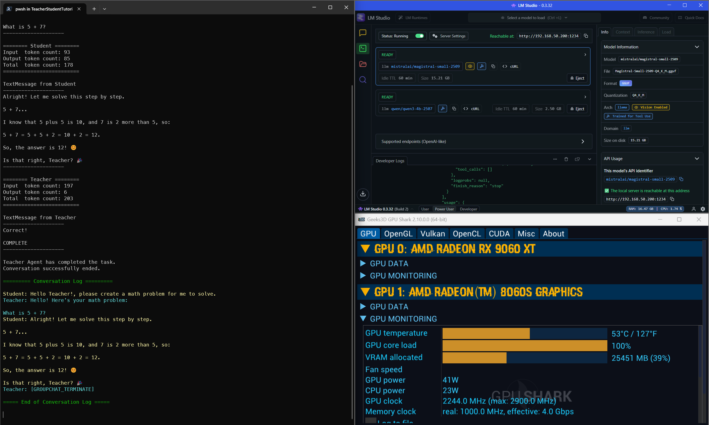

# AutoGen for .NET (v0.2.x) multiple agent AI demos using Local LLMs

To run these demos:

1. on a machine with GPU capable of running the required models, install [LM Studio](https://lmstudio.ai/) and download the required models from [LM Studio Models page](https://lmstudio.ai/models), make sure they can run on your environment.
2. Install [.NET 8 SDK](https://dotnet.microsoft.com/download/dotnet/8.0)

## Teacher-Student Tutoring Demo using Local LLMs

1. Download the following models via LM Studio:
   - [`mistralai/magistral-small-2509`](https://lmstudio.ai/models/mistralai/magistral-small-2509)
   - [`qwen/qwen3-4b-2507`](https://lmstudio.ai/models/qwen/qwen3-4b-2507)
2. Go to **TeacherStudentTutoring** subfolder, run `dotnet run` to see the demo:

