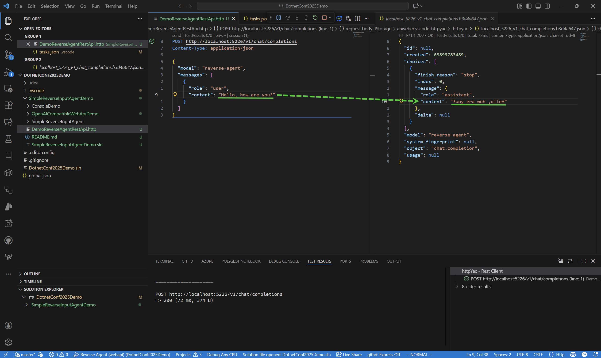

# Simple Reverse Input Agent Demo

This is for demonstration **AutoGen for .NET (v0.2.x)** agent capabilities, we can use a simple rule-based agent act as an OpenAI compatible LLM service.

We implement a _**Rule-based**_(Operation logic by coding) agent that can only do return the reversed string as the response on `SimpleReverseInputAgent` project folder using AutoGen for .NET (v0.2.x)'s `IAgent` interface.

## `ConsoleDemo` Project

The `ConsoleDemo` project demonstrates use the simple reverse agent in console application.

Just run the project, input any string, the agent will return the reversed string.

##  `OpenAICompatibleWebApiDemo` Project

The `OpenAICompatibleWebApiDemo` project demonstrates use the simple reverse agent in a OpenAI compatible Web API service via **AutoGen.WebAPI** nuget package.

Run the project, than use the *DemoReverseAgentRestApi.http* file to send request to the Web API service, the agent will return the reversed string like following screenshot:

